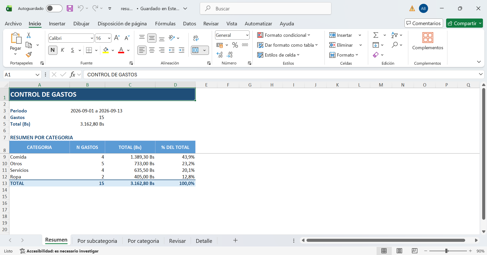
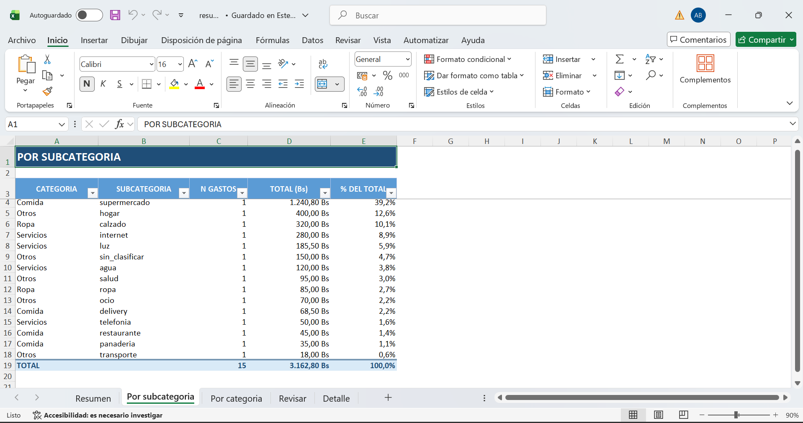

# control-gastos

Skill que toma un CSV de compras, clasifica cada gasto en **servicios**, **comida**, **ropa** u
**otros**, y devuelve un resumen con totales, porcentajes y subcategorias. Puede generar un CSV
ligero o un libro Excel `.xlsx` organizado en hojas.

La clasificacion es determinista: sin IA, sin API, sin claves y sin internet. La misma entrada
produce siempre el mismo resultado, y el usuario puede ver que palabra clave decido cada gasto.

## Requisitos

- Python 3.10 o superior.
- Para salida `.csv`: no hace falta instalar nada.
- Para salida `.xlsx`: instalar `openpyxl` con el archivo de requisitos:

```bash
python -m pip install -r assets/requirements-xlsx.txt
```

En una instalacion de Windows, la ruta absoluta es:

```cmd
python -m pip install -r "%USERPROFILE%\.agents\skills\control-gastos\assets\requirements-xlsx.txt"
```

Comprobar version: `python --version`

## Estructura

```
control-gastos/
├── SKILL.md                              # descripcion y reglas de la skill
├── README.md                             # este archivo
├── scripts/
│   ├── gastos.py                         # flujo completo: valida, clasifica, resume
│   └── demo.py                           # 6 casos base + salida XLSX
├── assets/
│   ├── categorias.json                   # diccionario de palabras clave (se edita a mano)
│   ├── ejemplo.csv                       # 15 gastos, separador de coma
│   ├── ejemplo-excel.csv                 # los mismos 15, como los exporta Excel en Bolivia
│   └── requirements-xlsx.txt             # dependencia para generar archivos .xlsx
├── references/
│   ├── REGLAS-CLASIFICACION.md           # por que clasifica asi y como extenderlo
│   └── FORMATO-ENTRADA.md                # columnas, formatos y todos los errores
└── capturas/                             # evidencia visual de la demostracion
    ├── 01-captura.png
    └── 02-captura.png
```

## Instalacion

Una skill es una carpeta. Se instala copiandola a la carpeta de skills del agente que uses. No hay
que registrar nada, no hay plugin que compilar y no hay que tocar ninguna configuracion.

### La ruta que lee casi todo el mundo

`~/.agents/skills/` es el estandar abierto de skills para agentes. Lo leen de forma nativa
**OpenAI Codex, Cursor, Gemini CLI, OpenCode, GitHub Copilot y VS Code**. Si no sabes con que
agente vas a trabajar, instala ahi y vas a acertar.

| Agente | Ruta global (disponible en todos tus proyectos) | Ruta de proyecto (solo ese repositorio) |
| --- | --- | --- |
| OpenAI Codex | `~/.agents/skills/control-gastos/` | `.agents/skills/control-gastos/` |
| Cursor | `~/.agents/skills/control-gastos/` | `.agents/skills/control-gastos/` |
| Gemini CLI | `~/.agents/skills/control-gastos/` | `.agents/skills/control-gastos/` |
| OpenCode | `~/.agents/skills/control-gastos/` | `.agents/skills/control-gastos/` |
| GitHub Copilot / VS Code | `~/.agents/skills/control-gastos/` | `.github/skills/control-gastos/` o `.agents/skills/control-gastos/` |
| Claude Code | `~/.claude/skills/control-gastos/` | `.claude/skills/control-gastos/` |

**La unica excepcion es Claude Code**: no lee `.agents/skills`, solo `.claude/skills`. Si usas
Claude Code, copiala tambien ahi. Codex ademas acepta `~/.codex/skills/` como ruta alternativa.

### Pasos

**Windows (PowerShell o cmd), ruta universal `.agents/skills`:**

```cmd
git clone https://github.com/Abner0810/tarea_skill.git
mkdir "%USERPROFILE%\.agents\skills"
xcopy /E /I /Y tarea_skill "%USERPROFILE%\.agents\skills\control-gastos"
```

**Windows, para Claude Code:**

```cmd
mkdir "%USERPROFILE%\.claude\skills"
xcopy /E /I /Y tarea_skill "%USERPROFILE%\.claude\skills\control-gastos"
```

**Linux o macOS, ruta universal `.agents/skills`:**

```bash
git clone https://github.com/Abner0810/tarea_skill.git
mkdir -p ~/.agents/skills
cp -R tarea_skill ~/.agents/skills/control-gastos
```

**Linux o macOS, para Claude Code:**

```bash
mkdir -p ~/.claude/skills
cp -R tarea_skill ~/.claude/skills/control-gastos
```

La carpeta de destino se llama `control-gastos` y no `tarea_skill`, porque **el nombre de la
carpeta es el nombre de la skill**. Si copias sin renombrar, el agente no la va a encontrar.

Despues hay que **reiniciar el agente**: las skills se cargan al arrancar y no se recargan en
caliente.

### Sincronizar los cambios

Si se desarrollo en el clon, hay que volver a copiar antes de probar o presentar:

```cmd
xcopy /E /I /Y tarea_skill "%USERPROFILE%\.agents\skills\control-gastos"
```

### Verificar la instalacion

```cmd
python "%USERPROFILE%\.agents\skills\control-gastos\scripts\demo.py"
```

Debe terminar con `RESULTADO: 7/7 casos pasan`. Ese mismo script es la demostracion de la
presentacion, asi que sirve para las dos cosas.

En Linux o macOS la ruta es `~/.agents/skills/control-gastos/scripts/demo.py`.

Y desde el chat del agente, con un mensaje normal: `usa la skill control-gastos y clasificame
C:\ruta\de\mis-gastos.csv`

## Como usarla

### 1. Caso exitoso

```bash
python scripts/gastos.py assets/ejemplo.csv
```

Salida en consola:

```
CONTROL DE GASTOS
================================================================
Periodo : 2026-09-01 a 2026-09-13
Gastos  : 15
Total   : Bs 3,162.80

CATEGORIA    SUBCATEGORIA       N         TOTAL       %
----------------------------------------------------------------
comida       supermercado       1      1,240.80   39.2%
otros        hogar              1        400.00   12.6%
ropa         calzado            1        320.00   10.1%
...
```

Y genera `resumen.csv`:

```csv
categoria,subcategoria,n_gastos,total_bs,porcentaje
comida,supermercado,1,1240.80,39.23
otros,hogar,1,400.00,12.65
...
TOTAL,,15,3162.80,100.00
```

### 2. Generar un Excel organizado

Instala la dependencia de Excel y usa una salida con extension `.xlsx`:

```bash
python -m pip install -r assets/requirements-xlsx.txt
python scripts/gastos.py assets/ejemplo-excel.csv -o resumen.xlsx -d
```

El libro contiene las hojas `Resumen`, `Por subcategoria`, `Por categoria`, `Revisar` y, cuando
se usa `-d`, `Detalle`. Incluye filtros, encabezado destacado, fechas y montos como valores de
Excel, porcentajes formateados y el gasto sin regla en una hoja separada. Sin `-d`, el libro
mantiene las hojas de resumen y revision.

### 3. Ver que palabra decidio cada gasto

```bash
python scripts/gastos.py assets/ejemplo.csv -d
```

Agrega una seccion `DETALLE DE CLASIFICACION` al final:

```
fila   4 | Supermercado Maxi             -> comida/supermercado  (por 'supermercado')
fila  12 | Pago al plomero               -> otros/hogar  (por 'plomero')
fila  16 | Regalo para mi mama           -> otros/sin_clasificar  (por '-')
```

### 4. Con tus propios gastos

Copiar `assets/ejemplo.csv`, poner tus filas, y:

```bash
python scripts/gastos.py mis-gastos.csv -o mi-resumen.csv
```

### 5. Con un archivo exportado de Excel

```bash
python scripts/gastos.py assets/ejemplo-excel.csv
```

Funciona sin configurar nada. Excel en Bolivia exporta con `;` como separador, `,` como decimal y
cabeceras con tilde (`Descripción`, `Importe`); la skill detecta el formato y tambien acepta
`Importe` como sinonimo de `monto` y `Concepto` como sinonimo de `descripcion`.

### 6. Entrada invalida

```bash
python scripts/gastos.py datos_malos.csv
```

```
ERROR: no se pudo procesar el archivo.
  - Fila 2: monto invalido 'doce' (debe ser un numero, por ejemplo 45.00 o "45,00").
  - Fila 3: fecha invalida 'ayer' (usa AAAA-MM-DD o DD/MM/AAAA).
Consulta references/FORMATO-ENTRADA.md
```

No genera una salida a medias. Sale con codigo `1`.

## Opciones

| Opcion | Por defecto | Para que sirve |
| --- | --- | --- |
| `-o, --salida` | `resumen.csv` | Elegir `.csv` o `.xlsx` y cambiar la ruta de salida |
| `-r, --reglas` | `assets/categorias.json` | Usar otro diccionario de categorias |
| `-d, --detalle` | apagado | Mostrar el detalle en consola y agregarlo al XLSX |

## Demostracion

```bash
python scripts/demo.py
```

Corre 7 casos de punta a punta y termina con `7/7 casos pasan`:

| Caso | Que prueba |
| --- | --- |
| 1 | Clasifica los 15 gastos de ejemplo y el total da Bs 3,162.80 |
| 2 | Rechaza un CSV sin la columna `monto` |
| 3 | Senala la fila con monto no numerico |
| 4 | Acumula dos errores distintos en una sola corrida |
| 5 | Distingue archivo inexistente de contenido invalido |
| 6 | Lee el formato real de Excel en Bolivia (`;`, `1.240,80`, tildes) y da el mismo total |
| 7 | Genera un `.xlsx` con hojas de resumen, revision y detalle |

Si `openpyxl` no esta instalado, el caso 7 se marca `OMITIDO` en vez de `FALLA` porque es una
dependencia opcional: el demo termina con `6/7 casos pasan, 1 omitido (falta openpyxl)` y con
codigo de salida `0`.

## Capturas

Evidencia visual de la demostracion, en `capturas/`.







## Como extenderla

Para agregar una palabra clave no se toca Python. Se edita `assets/categorias.json`:

```json
"salud": ["farmacia", "medico", "doctor", "dentista", "analisis", "hospital", "medicamento"]
```

Para agregar una subcategoria nueva, se agrega una clave dentro de su categoria. El script las
descubre sola, no hay lista que actualizar en el codigo.

## Requisitos del CSV de entrada

Encabezado con `fecha`, `descripcion`, `monto`, y opcionalmente `categoria`. Detalle completo,
ejemplos y la lista de errores en `references/FORMATO-ENTRADA.md`.

```csv
fecha,descripcion,monto
2026-09-01,Supermercado Maxi,240.80
2026-09-01,Factura de luz SETEX,185.50
2026-09-02,Taxi a la UCB,18
```

## Decisiones de diseno

**Por que Python y no Bash.** Los ejemplos de la clase usan scripts `.sh`, que en Windows no
corren sin WSL ni Git Bash. Python viene instalado en la mayoria de las maquinas y es el mismo
en los tres sistemas, asi que la demo funciona en la presentacion sin condiciones.

**Por que `openpyxl` para Excel.** La salida CSV no necesita dependencias. Para crear un libro
`.xlsx` real, con estilos, filtros y celdas nativas, la skill usa `openpyxl`. La dependencia esta
en `assets/requirements-xlsx.txt` y solo se importa cuando la extension de salida es `.xlsx`; si falta,
el comando indica exactamente que instalar. La version de la skill que usa esta dependencia es
`3.1.0` o superior.

**Por que un diccionario y no un modelo.** Un modelo puede clasificar "Regalo para mi mama" en
`ropa` con un 60% de confianza y nadie puede explicar por que. Con reglas, cada decision tiene una
palabra clave visible, y lo que no se reconoce cae en `otros` con aviso, no con una suposicion.

**Por que `otros` es una categoria y no un error.** Es la red de seguridad. Permite que la skill
acepte cualquier compra sin romperse, y a la vez mide cuanto cae ahi: la seccion `REVISAR` dice
cuanto dinero se esta classifying sin regla, que es justamente el trabajo de mejorar el
diccionario.

**Por que acumula errores.** Reportar el primer problema y frenar obliga a corregir y volver a
correr cinco veces. Reportarlos todos de una vez convierte cinco correcciones en una.

**Por que rechaza columnas desconocidas.** Una errata en la cabecera (`montot`) haria que el
archivo se procesara con una columna faltante y datos incompletos. Es mejor un error claro. Las
columnas con sinonimo conocido (`importe`, `concepto`) si se aceptan, para no obligar a renombrar
a mano los exportes de bancos.

**Por que detecta el separador solo.** Un CSV guardado desde Excel en Bolivia usa `;` y `,` como
decimal, exactamente al reves que el ejemplo de la clase. Obligar al usuario a convertir el
archivo antes de usarlo seria poner el trabajo de adaptacion de formato de parte de quien
presenta. Detectar el formato real es lo que hace que la skill funcione con datos de verdad.
